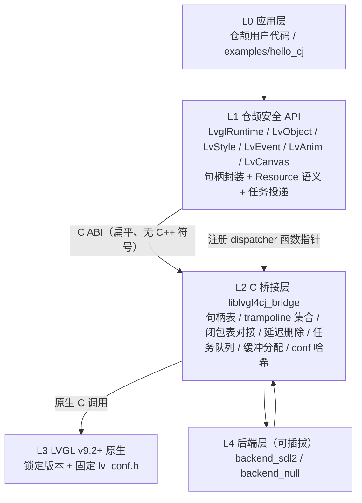
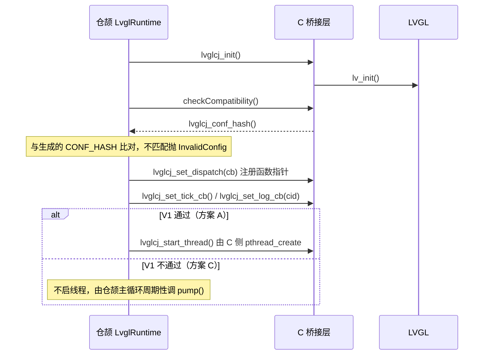
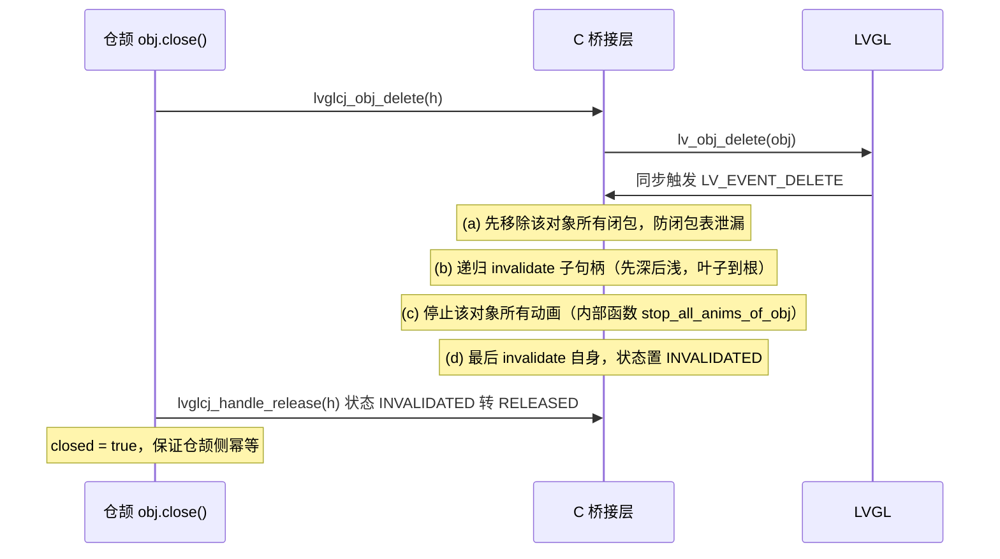
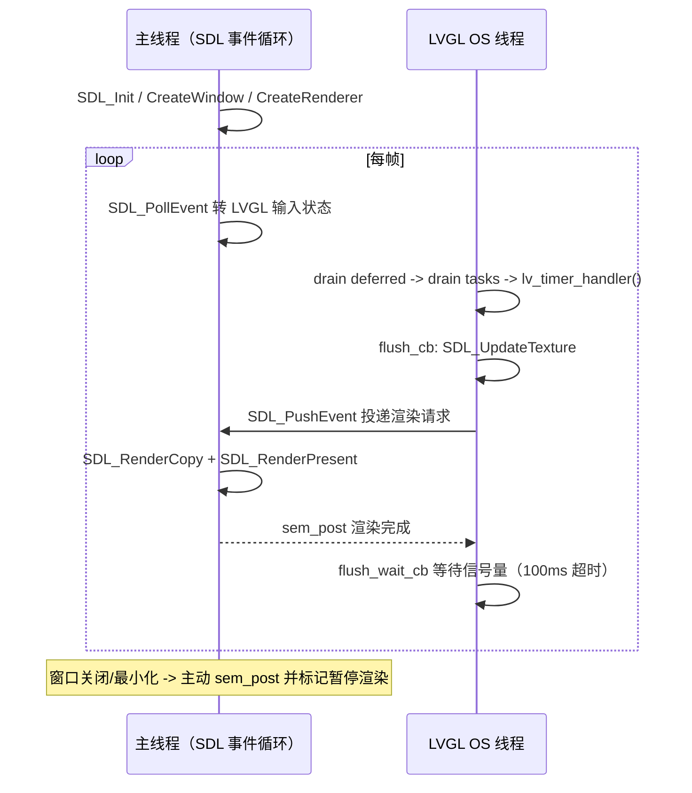
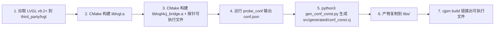

## 产品概述

`lvgl4cj` 是仓颉语言对 LVGL v9.2+ 的 C ABI 安全绑定框架，定位「受控 C ABI 工程」而非自动生成绑定的练习。目标平台为 Linux/WSL 桌面（SDL2 作为开发与验证环境），最终面向嵌入式 HMI。本次为**从零新建工程**，直接落地设计文档 v0.4 冻结版的 P0 阶段全部内容。

## 核心功能

- **不确定项定案**：实现 V1–V7 七项探针，用实测替代假设，产出结论表并归档对应架构决策
- **四态句柄表**：`UNINIT` / `ALIVE` / `INVALIDATED` / `RELEASED` 状态机，句柄失效可检测，无悬空指针与 double-free，`close()` / `release()` 幂等
- **回调桥接**：C 侧 trampoline 集合（event / timer / anim_exec / flush / indev_read / fs）转发到仓颉闭包表，回调抛出的异常在 C 边界被捕获并转为错误码与全局错误回调
- **生命周期级联失效**：父对象删除或 `clean()` 时递归失效子句柄；`clean()` 通过保存-恢复标志支持嵌套，只失效子不失效父
- **回调重入安全**：回调中删除对象或其自身走延迟删除队列，同帧内完成；连续 3 帧超限则强制同步清空并报错
- **绘制缓冲所有权**：缓冲在 C 侧分配并由桥接层持有，尺寸一律走 LVGL 官方 stride 算子，避免 GC 移动导致花屏
- **线程模型与任务投递**：单 LVGL OS 线程，业务线程通过 `post` 投递任务；有界队列默认 fail-fast；`postAndWait` 具备等待环死锁检测
- **SDL2 桌面后端**：800×480 窗口、手写 flush/read（不走 LVGL 内置 SDL 驱动）、带超时的刷新等待、窗口关闭即时解锁
- **动画上下文**：`anim_ctx` 统一承载目标对象与闭包，内部 deleted_cb 作为唯一释放点，覆盖自然结束 / 手动删除 / 对象删除三条路径
- **配置版本校验**：`lv_conf.h` 编译期宏转查询函数与哈希，启动时校验不匹配即明确报错

## 视觉与运行效果

运行 `hello_cj` 后弹出 800×480 深色背景窗口，中央一个带圆角的按钮，按钮文字为「点我」；鼠标可命中按钮（坐标正确、非花屏/非黑屏），点击后按钮文字实时变为「点了 N 次」，N 随点击递增；点击过程中界面持续刷帧不卡顿；关闭窗口或退出时进程干净释放全部句柄、缓冲与动画上下文，无崩溃、无泄漏报告。

## 范围与边界

- 仅 64 位平台；MVP 仅单窗口；LVGL 锁定 v9.2+，不承诺跨大版本兼容
- 明确非目标：`lv_draw_*` 底层绘制 API（改用 Canvas 控件）、`LV_EVENT_DRAW_*` 绘制事件（注册直接返回 `NOT_SUPPORTED`）、自定义 `lv_fs` 驱动注册、MCU / RTOS、32 位平台
- 首轮只交付 `obj` / `label` / `button` 三个控件，控件集扩展留待 P1

## 验收标准（八条断言）

1. `lv_timer_handler()` 主循环稳定运行 10 分钟不崩
2. flush 回调被调用，画面正确（非花屏、非黑屏）
3. 点击命中按钮，事件回调触发且坐标正确
4. 删除父容器后子对象句柄 `isAlive() == false`
5. 退出时 ASan 报告零泄漏
6. 回调中 `close()` 自身不崩溃，且同帧内对象确实被删除
7. 窗口关闭时 `flush_wait_cb` 立即返回，不挂死
8. `repeat(1)` 动画跑完后动画上下文被释放

## 技术栈选择

- 主语言：**仓颉 1.1.0**（`cjc` / `cjpm` / `cjfmt` / `cjlint` / `cjdb`），项目在 WSL 内构建运行
- 桥接层：**C11 + CMake ≥ 3.20**，编译器 clang / gcc ≥ 11
- 原生库：**LVGL v9.2+**（锁定 tag，保留 `LICENCE.txt` 与 commit 哈希）
- 桌面后端：**SDL2 ≥ 2.0.20**（`libsdl2-dev`），依赖 WSLg 提供窗口
- 构建辅助：`python3 ≥ 3.8`（生成 `conf_const.cj`），提供纯 CMake `configure_file` 兜底路径
- 内存检测：ASan（仅 C 桥接层与 LVGL 启用，仓颉侧不启用）+ suppression 文件
- 绑定层许可：Apache-2.0；LVGL 为 MIT

## 三处必须修正的设计前提（已用仓颉技能与本地工程实证）

### 1. 分支 A 在语言层不成立 → 分支 B 是唯一路径

`cangjie-ffi` 技能明确：**CFunc Lambda 不能捕获变量**。设计文档 §3.2 的「分支 A（直接持有闭包指针 + pin 表）」要求把捕获闭包转成 C 函数指针，V2-a 在语言层即不通过。

- 结论：**只实现分支 B（自建闭包表 + closure_id）**，不预留任何分支 A 代码路径
- 归档：pin 表、`PIN_EXHAUSTED`(-16)、风险 R16、ADR-018 标记为未采用；V2 探针保留为书面证据（一个编译失败的例子即可归档）
- 收益：工程量与不确定性同步下降，且删除了设计文档自己标注的「最危险的自欺」路径

### 2. `cjpm.toml` 的 FFI 配置写法修正

设计文档 §9.1 的 `[ffi.c] path = [...]` / `clink = [...]` **不是 cjpm 的语法**。`[ffi.c]` 的真实语义是「key 为库名、path 为库所在目录」，且**头文件目录无需声明**（`foreign func` 只需函数声明）。

本地实证更强的参考是本机 `cjqt6/cjpm.toml`（可正常构建的同语言绑定库）：它**完全不用 `[ffi.c]`**，而用 `[package] link-option = "-L<dir> -l<name>"` 配合 `[target.<triple>]` 做平台分叉。

- 结论：**首选 CJQT6 的 `link-option` + `[target.<triple>]` 模式**，`[ffi.c] <lib> = { path = "./libs/" }` 作为备选
- 注意静态库命名必须是 `lib<name>.a`，且 `cjc-version = "1.1.0"` 与本机 SDK 一致

### 3. C → 仓颉回调改走「函数指针注册」，不让 C 反向引用仓颉符号

CJQT6 的实证模式是仓颉直接传 `CFunc<(Int64) -> Unit>` 给 C，代价是回调只能靠全局变量通信、无法捕获上下文。

lvgl4cj 的正确组合：

1. 仓颉侧维护**真正的捕获闭包表** `HashMap<Int32, (Int64) -> Unit>`（闭包不跨 C 边界，可正常捕获）
2. 仓颉侧定义**顶层不捕获**的 dispatcher（`CFunc<(Int32, Int64) -> Int32>`，只查全局表）
3. 启动时用 `lvglcj_set_dispatch(cb)` 把该函数指针**注册给 C**
4. C 侧 trampoline 只调 `g_dispatch(cid, arg)`，**桥接库不引用任何仓颉符号**

收益：规避静态库未定义符号与链接顺序问题；不依赖 `@C` 导出符号名规则（技能未明确该规则，且提醒避免 `CJ_` 前缀以防与编译器内部符号冲突）。

## 实现策略

- **探针先行**：阶段 1 只写探针不写业务代码，V1–V7 全部出结论后再动 §3.2 / §3.6 相关实现（设计文档 §D.5 禁止事项）
- **双轨单一分叉点**：方案 A（C 侧 pthread 跑主循环）与方案 C（仓颉主循环调 `pump()`）共用同一套句柄表、回调桥接、延迟删除、任务队列抽象，**只有 `native/src/thread.c` 与 `src/runtime.cj` 分叉**，避免整体返工
- **重试与降级**：V1 通过走方案 A；不通过自动回退方案 C，并在启动日志与文档中标注「方案 C 下禁止宣传实时 HMI」
- **分层对齐成熟绑定**：L1 安全层 / L2 sys 桥接层的分层与 lv_binding_rust 一致；`Resource` + 显式 `close()`、禁用终结器的语义与 CJQT6 一致
- **性能目标**：单次 FFI 调用 ≤ 2 μs（待实测校准）；帧率 ≥ 30 FPS（800×480 局部刷新、约 50 对象）；输入延迟 ≤ 50 ms；启动 ≤ 500 ms。句柄表与闭包表查找均为平均 O(1)，延迟删除 drain 每帧上限 64 轮防止帧内饥饿
- **不做的事**：不引入新的声明式 UI 框架、不自动生成全量 API、不为 32 位预留抽象、不暴露 `lv_draw_*`；延迟删除与闭包表已覆盖的重入场景不再另建机制

## 架构设计



设计要点：L2 的 C 库**不依赖仓颉符号**（靠函数指针注册反向调用）；L4 后端是可插拔的，flush/read 手写以覆盖 trampoline 链路。

## 数据结构

### C 侧（`native/include/*.h`）

- 句柄表项：自增 `int64_t id`、`void* ptr`、`uint8_t state`（四态）、名称与删除栈（用于 `INVALIDATED` 保留调试信息）；句柄是**自增 ID 而非指针地址**（ADR-001，防地址复用误判存活）
- 动画上下文：`obj_handle` / `closure_id` / `anim_handle` / `user_deleted_cb`，作为 `lv_anim_t.var` 的唯一荷载，内部 deleted_cb 是其唯一释放点
- 延迟删除项：`op`（`DEFER_DELETE` / `DEFER_UNREG`）+ `handle` + `closure_id`
- 任务队列：环形缓冲，容量默认 1024，`pthread_mutex` + `pthread_cond`，满时默认 fail-fast
- 全局状态：`g_lvgl_thread_id`、`g_cleaning_parent`（保存-恢复支持嵌套）、`g_callback_depth`、`g_deferred_overrun_frames`、`t_wait_kind`（线程局部，仅 C 自身状态）、`g_dispatch` 函数指针

### 仓颉侧（`src/`）

- 闭包表模块：全局 `HashMap<Int32, (Int64) -> Unit>` + `Mutex` + 自增 `Int32` 分配器（溢出至 `Int32.MAX` 抛 `ClosureExhausted`），加上顶层不捕获的 dispatcher
- 句柄与错误：`LvHandle(Int64)` 值类型 + 四态判定；`LvglException <: Exception` 携带 `code: LvglError`（不可继承 `Error`）
- 队列模块：有界队列 + `Future`，区分「入队失败」与「任务执行失败」两种语义
- 运行时：`start()` / `pump()` / `post` / `postAsync` / `postAndWait` / `stop(mode)` / `runForever()` / `onError`

线程安全要点：`HashMap` 非线程安全，闭包表用 `Mutex` 保护；**取出闭包后必须先释放锁再调用**，防止重入死锁。

## 核心流程

### 1. 初始化和配置校验



### 2. 创建对象、注册回调与回调触发

对象创建时 C 侧在 `lvglcj_obj_create` 内**统一挂 DELETE 钩子**，保证所有经绑定层创建的对象都能被感知。注册回调时闭包入表得到 `closure_id`，`user_data` 装载该 ID（显式经 `intptr_t` 转换，不用指针地址）。触发时 trampoline 调 `g_dispatch(cid, arg)`，仓颉 dispatcher 查表取闭包、释放锁后调用，异常在边界被捕获转为错误码。

### 3. `close()` 级联失效（顺序在 `lifecycle.c` 写死并加注释锁定）



关键：`(a)` 必须在 `(b)(c)(d)` 之前；DELETE 钩子内不得 `free(anim_ctx)`（由内部 deleted_cb 唯一释放，防双重 free）。

### 4. 延迟删除

回调期间 `close()` 不立即生效，而是入队并标记 pending，返回 `OK_DEFERRED`(+1)；对象立即进入待删除状态，实际删除最迟同帧内完成。帧末 drain 每帧最多 64 轮，连续 3 帧超限则强制同步清空并报 `DEFERRED_LOOP`(-15)。

### 5. SDL2 帧循环（方案 A）



强制要求：`flush_wait_cb` 必须实现且必须带超时，超时记 `BACKEND_FAILURE` 但 LVGL 线程不得挂死；像素格式必须与 SDL 纹理格式一一对应（否则花屏）。方案 C 下本流程不适用。

### 6. 退出

`stop(Drain)` 按策略执行或丢弃剩余任务 → 停主循环 → 先 `lv_display_delete()` **再** `free(buf)` → `lvglcj_deinit()` → 校验句柄表与对象数差值恒定。

## 集成方式

### 构建链路



### `cjpm.toml`（照抄 CJQT6 实证模式，修正设计文档 §9.1）

```
[package]
  cjc-version = "1.1.0"
  name        = "lvgl4cj"
  version     = "0.1.0"
  output-type = "static"
  src-dir     = "src"
  target-dir  = "target"
  compile-option = "-Woff unused"
  link-option    = "-Llibs -llvgl4cj_bridge -llvgl -lSDL2 -lpthread -lm"

[target.x86_64-unknown-linux-gnu]
  link-option = "-Llibs -llvgl4cj_bridge -llvgl -lSDL2 -lpthread -lm"
```

备选写法（不使用 `link-option` 时）：`[ffi.c]` 下 `lvgl4cj_bridge = { path = "./libs/" }`、`lvgl = { path = "./libs/" }`。**严禁使用设计文档 §9.1 的 `path` / `clink` 数组写法。**

### WSL 构建位置策略

`/mnt/c` 在 WSL 下 I/O 较慢，源码保留在工作区（Windows 侧可见），**`build/` 与 `target/` 放 WSL 原生文件系统**：`scripts/build_native.sh` 用 `${LVGLCJ_BUILD_DIR:-$HOME/lvgl4cj-build}` 作为可覆盖默认值。

### 运行

`export LD_LIBRARY_PATH=libs:$LD_LIBRARY_PATH` 后执行 `cjpm run` 或直接运行产物；探针用 `scripts/run_probe.sh` 一键跑全。

## 目录结构

以下为新建文件清单（全部为 [NEW]，工作区当前仅有设计方案文档）。

```
lvgl4cj/
├── cjpm.toml                          # [NEW] 照抄 CJQT6 link-option 模式，cjc-version=1.1.0，link-option 含 -llvgl4cj_bridge -llvgl -lSDL2
├── src/                               # L1 仓颉安全 API 层
│   ├── main.cj                        # [NEW] 库入口包声明与公共导出
│   ├── runtime.cj                     # [NEW] LvglRuntime：start/pump/post/postAsync/postAndWait/stop/runForever/onError；方案 A/C 的唯一分叉点之一
│   ├── closure.cj                     # [NEW] 闭包表 HashMap<Int32,(Int64)->Unit> + Mutex + Int32 分配器 + 顶层不捕获 dispatcher（分支 B 核心）
│   ├── handle.cj                      # [NEW] LvHandle 值类型与四态判定、isAlive/close/release 幂等语义
│   ├── error.cj                       # [NEW] LvglError 枚举（附录 B 全量错误码）+ LvglException <: Exception + onError 派发
│   ├── queue.cj                       # [NEW] 有界任务队列 + Future；满时默认 fail-fast 抛 QueueFull；Drain/Discard/DrainWithTimeout 关闭策略
│   ├── ffi/bridge.cj                  # [NEW] 全部 foreign func 声明（对齐设计文档 §五 的 C ABI 清单）
│   ├── core/
│   │   ├── object.cj                  # [NEW] LvObject 基类：位置/尺寸/父子/标志/状态、screen_active/screen_load、drawTree 遍历
│   │   ├── display.cj                 # [NEW] LvDisplay：创建/color_format/flush_cb/flush_wait_cb/flush_ready/rotation/分辨率
│   │   ├── indev.cj                   # [NEW] LvIndev：pointer/keypad/encoder 创建与 read_cb、绑定 display
│   │   ├── event.cj                   # [NEW] LvEvent：on(Event, closure) 返回可 remove 句柄；target/currentTarget；stopBubbling；DRAW_* 直接返回 NotSupported
│   │   ├── style.cj                   # [NEW] LvStyle DSL：bgColor/bgOpa/radius/padAll/shadow*/text*，apply(style, selector)
│   │   ├── timer.cj                   # [NEW] LvTimer：create/delete/pause/resume/setPeriod/ready
│   │   ├── anim.cj                    # [NEW] LvAnim DSL：target/values/duration/path/onExec/start；不暴露 ctx 生命周期给用户
│   │   ├── canvas.cj                  # [NEW] LvCanvas：setBuffer/fillBg/drawPoint/drawLine/drawRect/drawArc/drawPolygon（lv_draw_* 的替代路径）
│   │   ├── font.cj                    # [NEW] LvFont：load/delete + 设置控件字体样式
│   │   └── group.cj                   # [NEW] LvGroup：create/add/remove/focus/focusNext/setDefault + indev 绑定
│   ├── widgets/
│   │   ├── label.cj                   # [NEW] LvLabel：create/setText/setAlign/setLongMode
│   │   └── button.cj                  # [NEW] LvButton：create/setSize/align/addLabel；P0 最小闭环控件
│   └── generated/
│       └── conf_const.cj              # [NEW] 由 gen_conf_const.py 产出；含 CONF_HASH 与 conf 常量，禁止手工编辑
├── native/                            # L2 C 桥接层
│   ├── CMakeLists.txt                 # [NEW] 构建 liblvgl.a（add_subdirectory third_party/lvgl）与 liblvgl4cj_bridge.a，含探针目标与 LVGLCJ_BUILD_PROBES 开关
│   ├── include/
│   │   ├── lvglcj_bridge.h            # [NEW] 对外 C ABI 全量声明（extern "C"），命名 lvglcj_<子系统>_<动作>
│   │   ├── lvglcj_error.h             # [NEW] 错误码枚举（0 成功 / +1 OK_DEFERRED / 负数错误）与 lvglcj_error_t 上下文结构
│   │   ├── handle_table.h             # [NEW] 四态句柄表接口：handle_of/alive/state/invalidate/release/pending_delete
│   │   ├── callback.h                 # [NEW] 六个 trampoline 声明 + closure_id 与指针互转内联函数（显式经 intptr_t）+ dispatch 注册接口
│   │   └── lv_conf.h                  # [NEW] 固定配置：LV_USE_SDL=0、LV_USE_LOG 按构建类型、LV_USE_FS_POSIX=1、LV_DEF_REFR_PERIOD=33
│   ├── src/
│   │   ├── handle_table.c             # [NEW] 自增 ID 句柄表；INVALIDATED 保留表项与删除栈；release 才回收内存
│   │   ├── lifecycle.c                # [NEW] DELETE 钩子四步顺序（a 闭包 -> b 递归子 -> c 停动画 -> d 自身）；obj_clean 的 g_cleaning_parent 保存-恢复
│   │   ├── callback.c                 # [NEW] trampoline T1/T2 实现；异常边界转错误码；调用 g_dispatch
│   │   ├── deferred.c                # [NEW] 延迟删除队列：入队/标记 pending/drain 64 轮上限/连续 3 帧强制清空报 DEFERRED_LOOP
│   │   ├── thread.c                   # [NEW] 方案 A 的 pthread 主循环与方案 C 的 pump 入口；g_lvgl_thread_id；两套线程断言宏（Release 保留）
│   │   ├── dispatch.c                 # [NEW] 保存仓颉注册的 dispatch 函数指针；提供 lvglcj_set_dispatch
│   │   ├── obj.c                      # [NEW] 对象创建/删除/clean/位置尺寸/标志状态/子对象查询/层序调整；创建时统一挂 DELETE 钩子
│   │   ├── display.c                  # [NEW] 显示创建；缓冲在 C 侧按 lv_draw_buf_width_to_stride 分配并持有；PARTIAL/DIRECT/FULL 校验；先 display_delete 再 free
│   │   ├── indev.c                    # [NEW] 输入设备创建/read_cb 绑定/绑定 display
│   │   ├── event.c                    # [NEW] 事件注册/注销/发送；param 双路径（句柄或标量）；target 与 current_target；DRAW_* 返回 NOT_SUPPORTED
│   │   ├── style.c                    # [NEW] style 创建/删除/40+ 属性 setter 与 getter（全部带 selector 后缀参数）
│   │   ├── timer.c                    # [NEW] timer 创建/删除/暂停/周期/timer_handler
│   │   ├── anim.c                     # [NEW] anim_ctx 分配与绑定；内部 internal_deleted_cb 自动挂载作为唯一释放点；obj_delete_anim 对外、stop_all_anims_of_obj 内部
│   │   ├── canvas.c                   # [NEW] canvas 缓冲设置与绘制图元转发
│   │   ├── group.c                    # [NEW] group 与键盘导航
│   │   ├── font.c                     # [NEW] 字体加载与释放
│   │   ├── conf_probe.c               # [NEW] 宏转查询函数 lvglcj_conf_* / lvglcj_conf_hash / lvglcj_version
│   │   ├── debug.c                    # [NEW] 对象树 dump / 内存监控 / 性能采样 / 句柄计数（泄漏检测依据）
│   │   └── log.c                      # [NEW] LVGL 日志转发到仓颉回调；统一错误记录 lvglcj_record_error
│   └── probe/
│       ├── probe_v1_thread_attach.c   # [NEW] C 侧 pthread_create 后回调仓颉函数指针，判定外部 OS 线程能否执行仓颉代码（决定 A/C）
│       ├── probe_v2_capture.c         # [NEW] 捕获闭包转 CFunc 的编译可行性证据（预期失败，归档分支 A）
│       ├── probe_v3_affinity.c        # [NEW] 仓颉 spawn 内采集 OS TID 集合，统计迁移次数
│       ├── probe_v6_sdl_thread.c      # [NEW] SDL2 双线程渲染同步 + 信号量超时验证（方案 C 下跳过）
│       ├── probe_v7_anim_deleted.c    # [NEW] deleted_cb 三路径（自然结束/手动删除/对象删除）触发验证；决定是否需要 anim 句柄表兜底
│       └── probe_conf.c               # [NEW] 输出 conf.json 供 gen_conf_const.py 消费
├── backend/
│   ├── sdl2/sdl2_backend.c            # [NEW] 窗口/渲染器/纹理；像素格式映射表；主线程事件循环与输入映射；flush 投递渲染请求；flush_wait 信号量 + 100ms 超时；窗口关闭即时解锁
│   └── null/null_backend.c            # [NEW] headless 后端，供 CI 与无显示环境使用
├── third_party/lvgl/                  # [NEW] git clone 锁定 v9.2+ tag，保留原始 LICENCE.txt 与 commit 哈希
├── examples/hello_cj/
│   ├── cjpm.toml                      # [NEW] 示例工程配置，引用 libs/
│   └── src/main.cj                    # [NEW] 800x480 深色窗口 + 居中按钮；点击文字由「点我」变「点了 N 次」；退出干净释放
├── test/
│   ├── unit/
│   │   ├── handle_test.cj             # [NEW] 四态转移、重复 close 安全、release 幂等
│   │   ├── callback_test.cj           # [NEW] 注册-触发-注销；对象删除时闭包自动清理；回调抛异常被吞并记录
│   │   ├── event_test.cj              # [NEW] target ≠ current_target；stopBubbling 生效；同事件码多回调按序全部触发
│   │   ├── thread_test.cj             # [NEW] 亲和性探针；跨线程调用抛 WrongThread
│   │   ├── anim_test.cj               # [NEW] 同 obj 多动画各自正确回调；自然结束不泄漏 ctx
│   │   └── deferred_test.cj           # [NEW] 回调中 close 不崩且同帧删除；链式删除不泄漏；连续 3 帧超限强制清空
│   ├── ffi_contract_test.cj           # [NEW] @C struct 的 sizeOf/alignOf 与 C 侧 offset 比对；枚举值一致性
│   ├── soak_test.cj                   # [NEW] 长时间运行：句柄与对象计数差值恒定、内存收敛
│   └── native/
│       ├── CMakeLists.txt             # [NEW] CTest 注册
│       └── test_handle_table.c        # [NEW] C 侧单测：句柄表四态、状态机、延迟队列
├── scripts/
│   ├── build_native.sh                # [NEW] CMake 配置与构建；BUILD_DIR 默认 $HOME/lvgl4cj-build；产物复制到 libs/
│   ├── run_probe.sh                   # [NEW] 一键编译并运行 V1–V7 全部探针，汇总结论
│   ├── gen_conf_const.py              # [NEW] conf.json 转 src/generated/conf_const.cj
│   └── asan_suppressions.txt          # [NEW] 屏蔽仓颉运行时符号；先用 nm 实证确认符号名
└── docs/
    ├── P0_QUICKSTART.md               # [NEW] 10 分钟在 WSL 跑通 hello_cj 的步骤
    ├── P0_RESULTS.md                  # [NEW] V1–V7 实测结论表与 ADR-013/014/015 归档记录
    ├── THREADING.md                   # [NEW] 线程使用规范（跨线程必须 post）
    ├── LIFECYCLE.md                   # [NEW] 句柄四态与延迟删除语义
    └── benchmarks/                    # [NEW] 指标基线：日期、平台、LVGL/仓颉版本、硬件、原始数据
```

## 关键代码结构

### 1. C 侧 dispatch 注册（`native/include/callback.h`）——解决 C 不引用仓颉符号

```c
/* 由仓颉侧在启动时注册；C 侧只保存函数指针，不引用任何仓颉符号 */
typedef int32_t (*lvglcj_dispatch_fn)(int32_t cid, int64_t arg);

int32_t lvglcj_set_dispatch(lvglcj_dispatch_fn fn);

/* closure_id <-> user_data 必须显式经 intptr_t，禁止直接把指针当地址用 */
static inline void   *lvglcj_cid_to_ptr(int32_t cid);
static inline int32_t lvglcj_ptr_to_cid(void *p);
```

`arg` 的统一语义：event / timer 传事件或定时器句柄；anim_exec 传动画插值；flush 传 display 句柄。约定「0 与负值不参与 cid 分配」。

### 2. 仓颉闭包表对外接口（`src/closure.cj`）

```
/* 注册捕获闭包，返回 closure_id；ID 耗尽抛 ClosureExhausted */
func registerClosure(cb: (Int64) -> Unit): Int32

/* 注销；闭包表为空时内部计数归零（用于泄漏断言） */
func unregisterClosure(cid: Int32): Unit

/* 顶层不捕获的 dispatcher，注册给 C；内部查表并释放锁后再调用闭包 */
func dispatchClosure(cid: Int32, arg: Int64): Int32

/* 桥接层 DELETE 钩子调用的批量清理入口 */
func unregisterAllOf(handle: Int64): Unit
```

关键约束：`dispatchClosure` 必须在调用闭包前释放闭包表锁，并在调用处 `try/catch` 捕获一切异常返回非 0。

### 3. 错误枚举（`src/error.cj`，对齐附录 B）

```
public enum LvglError {
    | Ok
    | OkDeferred
    | InvalidHandle
    | NotInitialized
    | InvalidConfig
    | CallbackThrew
    | OutOfMemory
    | WrongThread
    | DeadlockRisk
    | QueueFull
    | BackendFailure
    | InvalidArgument
    | ClosureExhausted
    | PendingDelete
    | NotSupported
    | VersionMismatch
    | DeferredLoop
}
```

`PinExhausted`(-16) 与 `AnimCtxLost`(-17) 中的前者因分支 A 归档而保留枚举但不产生；后者保留并在实现中触发。

## 实现注意事项

- **性能热路径**：句柄查找、闭包查表、`lv_obj_set_x` 类 setter 是热路径，均为 O(1)；不在 setter 内做字符串拼接或日志格式化（Debug 构建可用编译开关控制）；`SDLK` 事件循环每帧只做一次 `SDL_PollEvent` 排空，避免额外遍历
- **缓冲区**：任何缓冲尺寸都调 `lv_draw_buf_width_to_stride`，绝不自己算；ARM 带 cache 平台预留 ≥64B 对齐与 clean/invalidate 钩子位；`malloc` 失败返回 `OutOfMemory`，不静默降级
- **日志与可观测性**：复用 `log.c` 单一日志出口，区分 Debug / Release（`LV_USE_LOG` 编译期决定）；错误日志必须带 `code + handle + closure_id + func`，但不打印大块 payload，也绝不打仓颉闭包内容；`CALLBACK_THREW` / `WRONG_THREAD` 在长时间运行场景做速率限制，避免刷屏
- **爆炸半径控制**：`backend/*` 与 `native/src/*` 通过 `lvglcj_bridge.h` 单一头文件对外，内部符号用 `-fvisibility=hidden` 收敛；探针与测试目标用 CMake 开关隔离（`LVGLCJ_BUILD_PROBES`），不进入默认构建，避免拖慢日常编译
- **向后兼容**：P0 期间 C ABI 允许调整，但错误码数值与四态枚举**冻结不改**（测试与文档都依赖）；已归档的分支 A 相关 API 不导出到仓颉 L1 层，避免误用
- **禁止事项（须写入实现注释与文档）**：V1/V2 出结论前不写 §3.2 / §3.6 代码；不把仓颉 `Array<UInt8>` 指针传给 LVGL；回调内不同步等待 `post`；回调内不绕过延迟队列直删对象；Release 不关闭线程检查；`flush_wait_cb` 不无限阻塞；用户不手动释放动画上下文
- **门禁**：`cjfmt` 零 diff、`cjlint` 零告警、C 侧 CTest 与仓颉单测全绿、ASan 无报告（且先用人为泄漏验证 ASan 本身有效）；先跑通 `hello_cj` 与八条断言再加控件，跑不稳不加控件

## Agent Extensions

### Skill

- **cangjie-ffi**
- Purpose: 校验 `foreign` 声明、`CFunc`、`@C struct` 内存布局、`CPointer`/`inout`/`unsafe` 语义，以及 C 回调仓颉函数的正确写法
- Expected outcome: 全部 `foreign func` 声明与 trampoline/dipsatcher 签名一次编译通过，无类型映射错误
- **cangjie-ffi-build**
- Purpose: 确定 C 库的编译、链接与库命名规则（`lib<name>.a` / `.so`）及 `[ffi.c]` 与 `link-option` 的正确写法
- Expected outcome: `scripts/build_native.sh` 与 `cjpm.toml` 链接配置正确，`cjpm build` 可正常链接 `liblvgl4cj_bridge` 与 `liblvgl`
- **cangjie-project-management**
- Purpose: 核对 cjpm 的 `[package]` 字段、`[target.<triple>]` 分叉、`cjpm build/run/test` 行为与工作区用法
- Expected outcome: `cjpm.toml` 解析零警告，`cjpm build` / `cjpm test` 在 WSL 内正常执行
- **cjqt6**
- Purpose: 参考本地可运行的同语言 C ABI 绑定工程（工程结构、`CFunc` 用法、`close()` 语义、native 构建脚本、平台分叉配置）
- Expected outcome: lvgl4cj 的工程结构与构建脚本沿用已验证的同语言惯例，减少试错
- **cangjie-concurrency**
- Purpose: 正确使用 `Mutex` / `Condition` / `AtomicInt*` / `Future` / `spawn` / `sleep` / `SyncCounter` / `ThreadLocal`
- Expected outcome: 闭包表与任务队列线程安全；`Condition` 在持有锁状态下创建；回调调用路径不持锁，无重入死锁
- **cangjie-std-hashmap**
- Purpose: 确认 `HashMap` 的构造、`add`/`get`/`remove` 返回 `Option`、非线程安全等细节
- Expected outcome: 闭包表实现正确，`ClosureExhausted` 与泄漏计数逻辑无缺陷
- **cangjie-error-handle**
- Purpose: 正确实现 `LvglException <: Exception`、`try/catch` 模式匹配与 `finally` 清理
- Expected outcome: 错误模型与附录 B 错误码一致，回调边界异常被捕获而不跨越 C 边界
- **cangjie-unittest**
- Purpose: 编写 `@Test` / `@TestCase` / `@Assert` / `@BeforeEach` 单测与 `@Bench` 基准
- Expected outcome: 句柄、回调、事件、线程、动画、延迟删除六类单测全绿，八条断言可脚本化验证
- **cangjie-cjdb**
- Purpose: 定位崩溃与挂死（断点、仓颉线程栈、变量查看、attach 调试）
- Expected outcome: 段错误与死锁场景可定位到具体调用点，而不是靠猜测修改
- **cangjie-cjlint**
- Purpose: 静态检查并清零告警（命名、错误处理、并发、安全规范）
- Expected outcome: `cjlint` 零告警，满足 CI 门禁
- **cangjie-cjfmt**
- Purpose: 统一代码格式
- Expected outcome: `cjfmt --check` 零 diff

### SubAgent

- **code-explorer**
- Purpose: 在 `third_party/lvgl` 与本地 `CJQT6` 参考工程中定位构建脚本、CMake 组织、native 目录惯例与 FFI 配置实证
- Expected outcome: 产出可复用的构建脚本与目录组织依据，避免凭想象编写 CMake 与链接配置